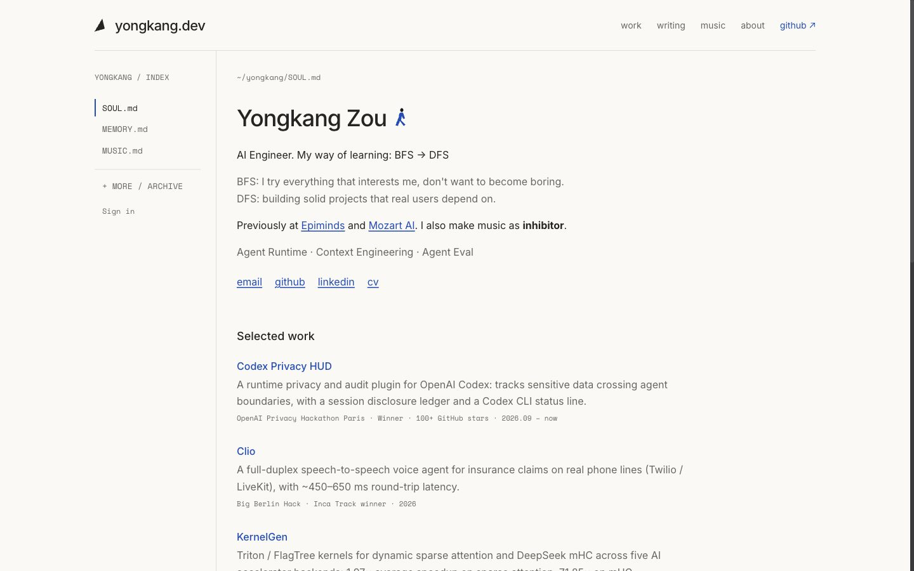

# yongkang.dev

Personal site of Yongkang Zou — AI engineer. My way of learning: BFS → DFS.

A scroll-driven intro tells the journey (Nanjing → Paris, economics → AI), then
the site settles into a quiet "open document": a file-tree index on the left,
plain editorial pages on the right.

**Live at [yongkang.dev](https://yongkang.dev)**




## Stack

- **Frontend:** React 19 + Vite + TanStack Query + react-router 7, GSAP (ScrollTrigger), WebGL
- **Backend:** Go (chi router), serverless on Vercel (`api/index.go`)
- **Database:** Supabase (PostgreSQL + Storage) — content admin-editable in place
- **AI:** Gemini API for blog post drafting & refinement with image analysis
- **CV:** LaTeX sources compiled with pdfLaTeX / XeLaTeX (`make cv`)
- **Deploy:** Vercel Git integration (push to `main`) + Cloudflare DNS

## Pages

| Route | Page |
|---|---|
| `/` | Journey intro — 7 scroll-scrubbed shots + the name card |
| `/files/soul` | **SOUL.md** — bio, selected work, writing, background, one playable track |
| `/files/memory` | **MEMORY.md** — writing, filterable by category; posts with likes and comments |
| `/files/music` | **MUSIC.md** — inhibitor, track list, persistent player |
| `/files/skill` · `/experience` · `/cv` · `/hackathons` | Skills, experience, CV (PDF + `.tex` source), hackathons |
| `/files/soul/graph` · `/commits` | Knowledge graph, GitHub contributions |
| `/files/contact` · `/files/memory/guestbook` | Contact links + form, guestbook |
| `/files/admin` | **ADMIN.md** — posts, music, feedback, notifications (admin only) |

Old URLs (`/files/soul/journey`, `/files/soul/projects`, `/files/skill/resume`, …) redirect to their new homes.

## Development

```bash
# Backend (:8080) + frontend (:5173); Vite proxies /api to the backend
make dev

# Or separately
cd backend && go run cmd/server/main.go
cd frontend && npm run dev

# Tests / lint
cd frontend && npm test            # vitest
cd frontend && npm run test:e2e    # playwright
cd frontend && npm run lint

# Rebuild the CV PDFs after editing cv/<lang>/resume.tex
make cv

# Deploy: Vercel builds and ships every push to main
git push origin main
```

Local dev talks to the **production** Supabase — admin actions on localhost change live data.
For GitHub sign-in on localhost, Supabase Auth → Redirect URLs must include `http://localhost:5173/**`.

## Architecture

```
api/index.go                Vercel serverless entrypoint (same chi router as dev)
backend/
  pkg/handler/              API handlers + Gemini drafting
  pkg/middleware/           CORS, logging, rate limits, AdminOnly (Supabase JWT + ADMIN_EMAIL)
  pkg/service/              PortfolioService: Supabase first, embedded JSON fallback
  pkg/repository/           SupabaseRepository (lib/pq) · EmbeddedRepository (go:embed)
  data/*.json               Fallback data
cv/                         CV sources (en: pdfLaTeX, zh: XeLaTeX + resume.cls) + build.sh
frontend/
  public/intro/shots/       Intro bitmap layers (WebP, generated from the storyboard)
  public/cv/                Published CV PDFs and sources
  src/components/
    intro/                  IntroLab (timeline), pixelStretch (WebGL split & stretch),
                            StudyInk (SVG text/diagrams over the shots)
    doc/                    DocumentLayout — top bar, file-tree directory, breadcrumb, footer
    soul/                   SOUL.md page, selected work, knowledge graph, contributions
    skill/                  Skills, experience, CV viewer, hackathons
    admin/                  AdminBar, EditableItem, PostEditor, editors, media upload
    global/                 BlogPostContent, PostInteractions, MusicPlayerBar, ErrorBoundary
  src/lib/                  api.ts (?_t= cache busting), auth, MusicPlayerContext, markdown
  src/styles/document.css   The paper design system for every /files page
```

### The journey intro

- **Scroll is the clock.** A pinned GSAP ScrollTrigger scrubs one timeline (~12 viewport
  heights); it plays backwards as naturally as forwards. A `play` mode runs it on its own.
- **Bitmap layers + SVG ink.** Each shot is a few WebP layers generated from the storyboard
  crops (environment, character poses, foreground). All legible text — book titles,
  formulas, the Transformer diagram — is SVG laid over the art, so it is always spelled right.
- **Horizontal pixel stretch** (`pixelStretch.ts`, WebGL with a Canvas 2D fallback): in shot 04
  the frame is cut at the centre, the halves slide apart and the gap fills with the cut
  columns stretched into strictly horizontal bands; then the next scene opens from the
  centre. 07 → 08 reuses it, collapsing the bands into the page's divider rules.
- `prefers-reduced-motion` gets static keyframes with captions; captions switch EN / 中.

### Data flow

```
Request → chi router → middleware (CORS, Logger, RateLimit, AdminOnly)
                            ↓
                  handler → PortfolioService
                     ↓                ↓
          SupabaseRepository    EmbeddedRepository
             (primary)            (go:embed fallback)
```

GET handlers set `Vercel-CDN-Cache-Control: s-maxage=86400`; the client appends `?_t=` to
every request so fresh data shows right after an admin edit.

## Key features

- **Inline admin editing** — sign in with GitHub, edit content in place
- **AI blog drafting** — draft from a rough idea or refine an existing post with Gemini
- **Blog rendering** — markdown ↔ HTML round-trip that keeps mermaid diagrams, videos,
  photo galleries (`## Photos`) and a lightbox
- **Persistent music player** — keeps playing across pages
- **CV as source** — PDF preview, download, and a "View source (.tex)" toggle
- **Knowledge graph** — force-directed graph generated from Supabase data
- **Accessible** — keyboard focus, reduced-motion paths, semantic landmarks

## Branches

- `main` — the live site
- `archive-design` — the previous dark file-system design

## Env vars

| Variable | Purpose |
|---|---|
| `SUPABASE_URL` | Supabase project URL |
| `SUPABASE_ANON_KEY` | Supabase anonymous key |
| `DATABASE_URL` | PostgreSQL connection string |
| `ADMIN_EMAIL` | Admin gate — must match the GitHub account's email exactly |
| `FRONTEND_URL` | CORS origin |
| `GEMINI_API_KEY` | Gemini API for AI drafting & refinement |
