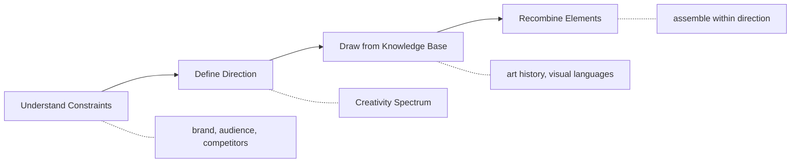
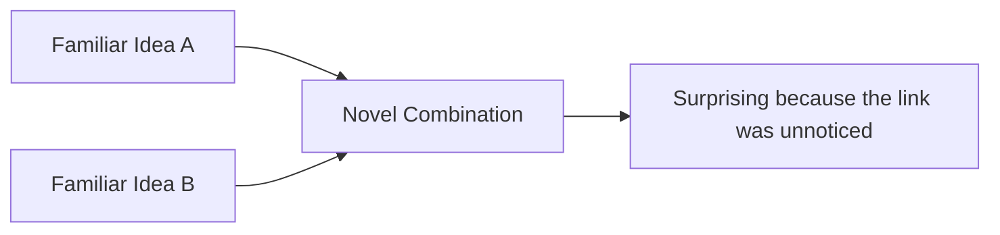
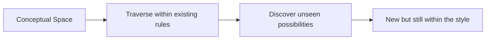
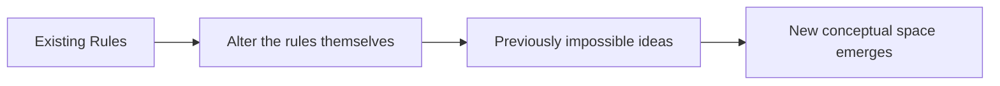
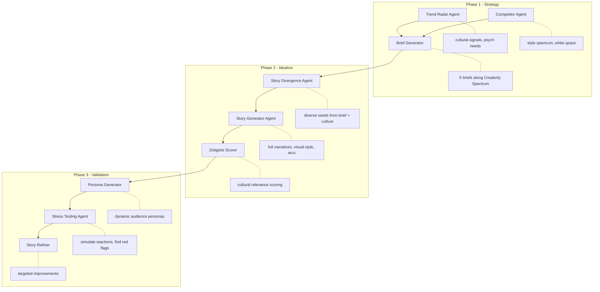
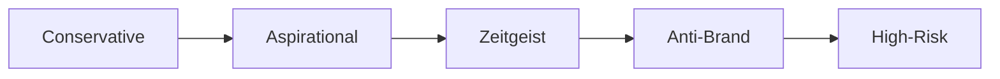
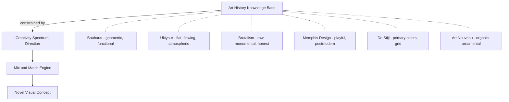
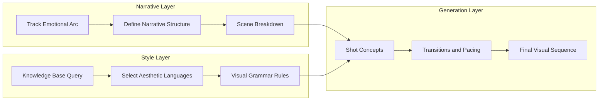
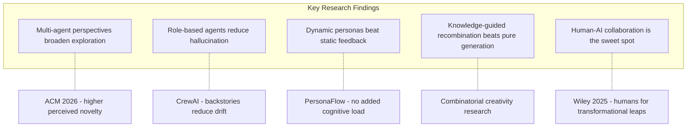
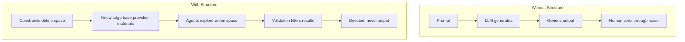

## The Architecture of Creative Machines

There's a common misconception that creativity is magic, that great ideas arrive in flashes of genius, untraceable and unrepeatable. Having worked on AI-powered creative systems at two hackathons, I've come to believe the opposite: creativity has structure. And that structure can be engineered.

This post is about how to simulate human creative teamwork in agentic systems. Not by replacing human creativity, but by reverse-engineering the process that makes brainstorming sessions actually work, then encoding it into multi-agent pipelines.

## What Happens in a Real Creative Room

During the ElevenLabs hackathon, our team had an unusual advantage. Alison, an ex-Global Creative Director at Unilever, walked us through how she'd run ideation sessions for global campaigns. After a deep interview session, we reverse-engineered her process:

The process isn't linear in practice. It's iterative. But the critical insight is that **ideation never starts from zero**. It starts from constraints. Product attributes, brand positioning, audience segments, competitive landscape. These aren't limitations on creativity. They're the raw ingredients of it.

We called the directional step the "Creativity Spectrum". Not a single creative brief, but a structured range of possible directions spanning from conservative to provocative. You don't jump straight to ideas. You first constrain the search space intelligently, then explore within it.

## The Theoretical Foundation

Margaret Boden's foundational framework identifies three types of creativity:

**Combinational** - making unfamiliar combinations of familiar ideas. The most common form. Think analogy, metaphor, collage.

**Exploratory** - searching within an existing conceptual space for possibilities nobody has found yet. The rules stay the same. You just go deeper.

**Transformational** - changing the rules of the space itself. The rarest and most radical form. What was previously inconceivable becomes possible.

Most LLM-based systems operate purely in **combinational** mode. They remix patterns from training data. That's useful but limited. They're good at juxtaposition but terrible at knowing *which* juxtapositions are worth pursuing.

The real unlock comes from making the exploration **structured**. From giving agents the equivalent of taste.

Arthur Koestler called this "bisociation": the intersection of two independent matrices of thought that produces something genuinely new. A tailor's craftsmanship meets whisky distillation. A baroque painting composition meets a music video shot list. The creativity isn't in either domain alone. It's in the collision. But the collision has to be *directed*. Random collisions produce noise.

This is what separates a curated knowledge base from a vector database. A vector database finds similarities. A curated creative knowledge base enables intentional collisions between dissimilar domains, guided by strategic intent.

## The VideoStack Architecture

In our [VideoStack project](https://github.com/VideoStack-PE/videostack-elevenlabs), we decomposed the creative process into specialized agents that mirror real team roles:

### Phase 1: Setting the Stage

The strategy phase doesn't generate ideas. It generates the **frame** within which ideas will be judged.

The **Trend Radar Agent** scans cultural signals and maps them to psychological needs: belonging, rebellion, identity, escapism, achievement. Not just "what's trending" but "what human need is this trend serving?"

The **Competitor Agent** maps the competitive style landscape on a 2D spectrum (traditional vs. experimental, mass-market vs. niche) and identifies white space. Where is nobody playing?

The **Brief Generator** synthesizes the above into 5 creative brief variants along the Creativity Spectrum:

Each brief is a different bet. Conservative plays it safe with proven patterns. Zeitgeist rides current cultural waves. Anti-Brand deliberately subverts category conventions. The spectrum ensures you're not optimizing for one direction too early.

### Phase 2: Divergent Generation

This is the brainstorming phase. Like IDEO's rule of "go for quantity", we generate 10 stories across different emotional tones, narrative structures, and visual styles. Diversity is the objective, not convergence.

The **Story Divergence Agent** takes a brief and produces seeds. Each seed varies on dimensions:

- Emotional tone (dark humor, tender, rebellious, aspirational)
- Narrative structure (hero's journey, vignette, parallel stories, single metaphor)
- Visual style (lo-fi, cinematic, surreal, documentary)
- Cultural anchor (craftsmanship, street culture, mythology, technology)

The **Story Generator** expands seeds into full narratives with story beats, emotional arcs, visual descriptions, and psychological impact notes. These aren't just ideas. They're structured enough to be stress-tested.

The **Zeitgeist Scorer** evaluates cultural relevance: trend alignment, cultural authenticity, audience resonance. A filter, not a gatekeeper. Low scores don't kill ideas. They flag where more work is needed.

### Phase 3: Convergent Validation

This replaces the "let's sleep on it" moment in human teams. The agents simulate the audience *before* you've spent budget on production.

The **Persona Generator** creates 3-5 audience personas specific to the brand context. Not generic demographics. Real behavioral profiles with media consumption patterns, cultural sensitivities, and brand relationships.

The **Stress Testing Agent** simulates each persona encountering the story. What's their initial reaction? What concerns them? What would they share? Where are the red flags?

The **Story Refiner** takes stress test results and proposes targeted improvements. Not rewrites. Surgical fixes that address specific audience friction while preserving the creative core.

## The Knowledge Base as Creative Arsenal

Here's what I believe is the most underexplored idea in agentic creativity: **the knowledge base is not just retrieval. It's the source of creative material.**

We built ours from art history. Why? Because art history is a **structured repository of visual decisions**. Every movement represents a coherent set of choices about color, composition, texture, and emotional intent. These aren't random images in a database. They're *design systems* from throughout history.

When an agent pulls from this knowledge base during ideation, it's doing what a creative director does: referencing visual languages to construct something new. "Take the compositional rigor of De Stijl, combine it with the organic fluidity of Art Nouveau, apply it to a whisky brand that wants to feel both structured and alive." That's not random generation. That's directed bisociation.

The critical mechanism: these elements are combined **within the constraints of the Creativity Spectrum direction**. The conservative brief pulls from classical, established aesthetics. The anti-brand brief might smash Brutalism into Y2K internet culture. Same knowledge base, different constraint vectors.

This is what I mean by "same materials, different architects." Every new idea comes from the same basic elements. They're just assembled differently. The architect's taste is encoded in the constraints.

## The Mozart Extension: Narrative Before Visual

In our Mozart music video project, we extended this pattern. The insight: visual creativity in video production doesn't start with visuals. It starts with narrative.

The pipeline works in layers. Each layer constrains the next:

**Narrative Layer** - a narrative agent analyzes the track's emotional trajectory. Where does the tension build? Where does it release? What's the lyrical story? This defines the structure all visuals must serve.

**Style Layer** - given the narrative intent, a style agent queries the knowledge base for aesthetic languages that express those emotions. A melancholic bridge might pull from Edward Hopper's isolation compositions. An energetic drop might reference Futurist dynamism. The style choices aren't arbitrary. They're semantically linked to the narrative intent.

**Generation Layer** - specific shots, transitions, and compositions that express the grammar within the arc. This is where AI generation tools actually produce output. But by this point, the output is heavily constrained by the layers above. It feels *directed* rather than random.

This mirrors how actual music video directors work. Michel Gondry establishes conceptual frameworks (physical metaphors for emotional states). Hype Williams builds visual systems (symmetry, color saturation, scale). They don't generate random visuals. They define a vocabulary first, then compose within it.

The difference between AI-generated video that feels like "AI art" versus video that feels directed is exactly this: **whether there's a coherent aesthetic system governing the generation, or just a prompt**.

## What the Research Shows

This approach aligns with recent findings:

**Multi-agent systems improve structured ideation.** A 2026 paper from ACM ("Towards AI as Colleagues") found that exposure to multiple AI colleague perspectives supported "broader and deeper exploration." Participants spent more time developing each idea and reported higher perceived outcome quality and novelty. The mechanism: different agent perspectives force you out of local optima.

**Role-based agents reduce hallucination.** CrewAI's design philosophy of assigning clear backstories and responsibility boundaries reduces model drift. When an agent knows it's a "trend analyst" with a specific mandate, it stays focused. This is analogous to how real teams work. A strategist who tries to also be the copywriter produces mediocre strategy AND mediocre copy.

**Dynamic personas beat static feedback.** Our stress testing approach (generating audience personas on the fly, then simulating their reactions) mirrors PersonaFlow research (2024) showing that AI-simulated expert perspectives increase both relevance and creativity without increasing cognitive load. The key: personas are generated fresh for each brand context, not pulled from a generic template.

**Knowledge-guided recombination outperforms pure generation.** Research on combinatorial creativity (arXiv 2025) shows that systems using structured knowledge retrieval for ideation consistently produce outputs rated higher on novelty and value than systems relying solely on parametric generation. The knowledge base acts as a constraint that paradoxically increases creative quality.

**Human-AI collaboration is the prevailing model.** A 2025 Wiley study ("Human-AI Co-Creativity") confirmed that AI excels at combinatorial creativity but humans are needed for transformational leaps. Only 0.28% of AI-generated ideas reached top-tier human creativity benchmarks. The sweet spot: human strategic direction with AI volume and recombination speed.

## A Deeper Look: Why Structure Enables Creativity

There's a persistent myth that constraints kill creativity. The opposite is true. Every creative professional knows this intuitively.

A sonnet's 14-line iambic pentameter constraint is what makes it a sonnet. Remove the constraint and you have free verse, which is harder to write well, not easier. The constraint is a creative amplifier.

In agentic systems, the equivalent constraints are:

1. **Role boundaries** - each agent has a clear mandate and stays in lane
2. **Sequential dependency** - strategy before ideation, ideation before validation
3. **Knowledge scope** - agents draw from curated domains, not "everything"
4. **Evaluation criteria** - explicit scoring rubrics prevent drift toward generic

IDEO's brainstorming rules work the same way. "Defer judgment," "go for quantity," "build on others' ideas," "stay focused on topic." These are constraints. They're what make brainstorming produce results instead of chaos. Our agent architecture encodes the same principles in software.

## Practical Takeaways

If you're building systems that need to be creative:

**1. Separate strategy from generation.** Don't ask one prompt to both define the direction AND produce ideas. Build separate agents for each. The strategist constrains; the ideator explores. Mixing these roles produces neither good strategy nor good ideas.

**2. Build a curated knowledge base, not just RAG.** Generic retrieval produces generic ideas. Curate your knowledge base with intention. Art history, design systems, cultural references, whatever your domain needs. Structure it so agents can mix-and-match across categories. The curation IS the taste.

**3. Use the Creativity Spectrum pattern.** Generate along a range from safe to radical. Don't optimize for one "best" idea early. Diverge first, converge later. The conservative option gives you a safety net. The radical options give you breakthroughs. Often the shipping version lives somewhere in between.

**4. Simulate the audience before you ship.** Dynamic persona generation + stress testing catches issues that single-perspective review misses. It's cheaper than real user testing for early-stage concepts, and it catches cultural blind spots that homogeneous teams miss.

**5. Narrative before execution.** Whether it's a video, an ad campaign, or a product concept, establish the "why" and the "how it feels" before generating the "what it looks like." Aesthetics without narrative are decoration. Narrative gives aesthetics meaning.

**6. Every agent needs a role, a backstory, and constraints.** Like IDEO's brainstorming rules, the structure doesn't kill creativity. It channels it. Agents without clear roles produce slop. Agents with clear roles and curated knowledge bases produce directed novelty.

## The Bigger Picture

I think we're at an inflection point. The question isn't "can AI be creative?" anymore. It's "can we architect systems that produce creative work reliably, at scale, while still surprising us?"

The answer is yes, but only when we stop treating AI as a single oracle and start treating it as a team. A team with specialists, with a shared knowledge base, with a process that mirrors how human creativity actually works.

The Creativity Spectrum is really about giving structure to intuition. Not replacing the human creative director. Giving them a system that can explore at the speed and breadth that no human team can match, while maintaining the strategic coherence that no unsupervised AI can achieve.

Same materials. Different architects. Directed collisions. That's the architecture of creative machines.

## References

- Boden, M. A. (2004). [*The Creative Mind: Myths and Mechanisms*](https://www.interaliamag.org/articles/margaret-boden-creativity-in-a-nutshell/). Routledge.
- Koestler, A. (1964). [*The Act of Creation*](https://www.themarginalian.org/2013/05/20/arthur-koestler-creativity-bisociation/). Hutchinson & Co.
- [Towards AI as Colleagues: Multi-Agent System Improves Structured Ideation](https://arxiv.org/html/2510.23904) (2026). ACM.
- [Understanding Human-Multi-Agent Team Formation for Creative Work](https://arxiv.org/html/2601.13865) (2026). arXiv.
- [Human-AI Co-Creativity: Does ChatGPT Make Us More Creative?](https://onlinelibrary.wiley.com/doi/full/10.1002/jocb.70022) (2025). Wiley.
- [Human-AI Co-ideation via Combinational Generative Model](https://www.tandfonline.com/doi/full/10.1080/09544828.2025.2504309) (2025). Taylor & Francis.
- [Collaborating with AI Agents: Field Experiments on Teamwork](https://arxiv.org/abs/2503.18238) (2025). arXiv.
- [PersonaFlow: Designing LLM-Simulated Expert Perspectives](https://arxiv.org/html/2409.12538v2) (2024). arXiv.
- [Combinatorial Creativity: A New Frontier in Generalization](https://arxiv.org/html/2509.21043v3) (2025). arXiv.
- [The Rules of Brainstorming Change When AI Gets Involved](https://www.ideo.com/journal/the-rules-of-brainstorming-change-when-artificial-intelligence-gets-involved-heres-how) (2024). IDEO.
- [From Sound to Sight: Towards AI-authored Music Videos](https://arxiv.org/html/2509.00029v1) (2025). arXiv.
- [CrewAI Framework](https://github.com/crewaiinc/crewai) - Role-based multi-agent orchestration.
- [VideoStack Project](https://github.com/VideoStack-PE/videostack-elevenlabs) - AI-powered video campaign platform.
