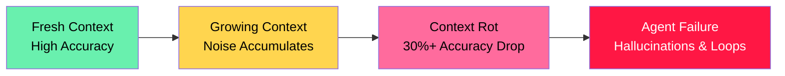
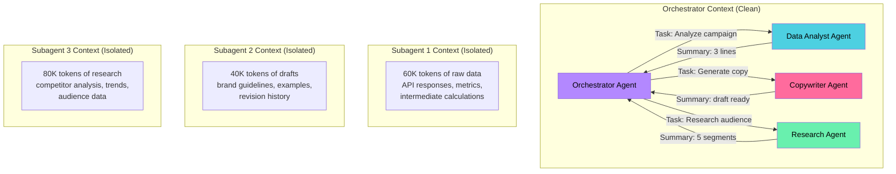
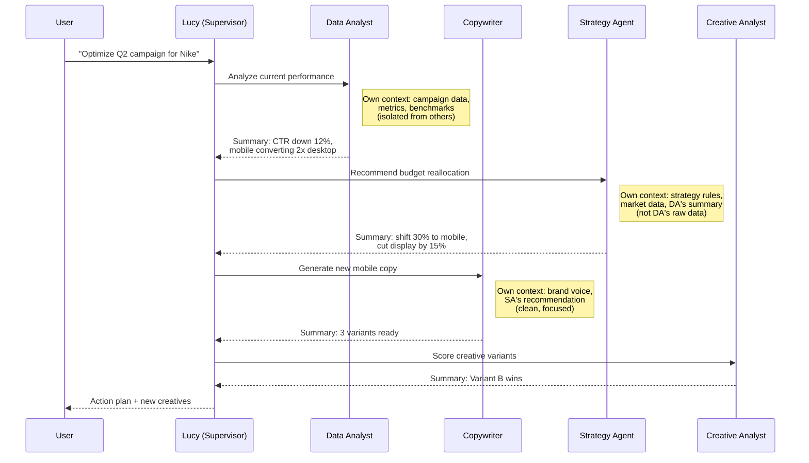
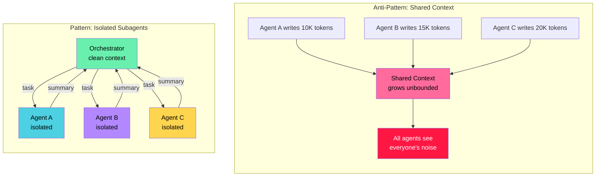

## Context Rot Is Real, and Subagents Are the Fix

Working on multi-agent systems at Epiminds, I spent a lot of time thinking about why agents get worse the longer they run. The answer is context rot, and the most practical solution I've found is subagent-driven context isolation.

This post breaks down the problem, the architecture, and what I learned building production agent systems.

## The Problem: Your Agent Gets Dumber Over Time

Every LLM suffers from context rot. [Chroma's research](https://www.morphllm.com/context-rot) tested 18 frontier models (GPT-4.1, Claude Opus 4, Gemini 2.5 Pro, Qwen3-235B) and found that **every single one** gets measurably worse as input length increases.

Three mechanisms are at play:

1. **Lost-in-the-middle effect** — models attend well to the start and end of their context but poorly to the middle. Accuracy drops 30%+ when relevant info sits in positions 5-15 of a 20-document window.
2. **Attention dilution** — transformer attention is quadratic. At 100K tokens, the model tracks 10 billion pairwise relationships. Each new token dilutes attention on everything else.
3. **Distractor interference** — semantically similar but irrelevant content actively misleads the model. This is especially bad for coding agents that accumulate search results and backtracking noise.

The practical effect: [Cognition found](https://www.morphllm.com/context-rot) that by the time a coding agent finds the relevant code, the signal-to-noise ratio in its context is **2.5%**. Doubling task duration quadruples the failure rate.

## The Solution: Subagent Context Isolation

The key insight: **don't let one agent accumulate everything**. Delegate work to subagents that run in isolated context windows, do their job, and return only a summary to the parent.

This is the same principle behind [Claude Code's subagent architecture](https://docs.anthropic.com/en/docs/claude-code/sub-agents), [LangChain's Deep Agents](https://www.marktechpost.com/2026/03/15/langchain-releases-deep-agents-a-structured-runtime-for-planning-memory-and-context-isolation-in-multi-step-ai-agents/), and what we built at Epiminds. The parent orchestrator stays clean. The heavy lifting happens elsewhere.

Without isolation, the orchestrator would hold 180K+ tokens of accumulated context. With isolation, it holds maybe 2K tokens of clean summaries. The quality difference is dramatic.

## How We Built This at Epiminds

At [Epiminds](https://epiminds.com/), we built a multi-agent marketing platform with 20+ specialized agents coordinating under a supervisor architecture. The core product, Lucy, manages campaigns end-to-end: reporting, pacing, creative analysis, budget optimization.

The framework follows a supervisor pattern similar to [AutoGen's GroupChat](https://arxiv.org/abs/2308.08155) and [VoltAgent's](https://voltagent.dev/) agent orchestration, but tuned for marketing workflows.

### The Supervisor Pattern

Each agent gets only what it needs. The Data Analyst never sees brand guidelines. The Copywriter never sees raw API metrics. This isn't just about context window limits. It's about **signal quality**. A copywriter with 60K tokens of campaign metrics in its context writes worse copy, even if the window can hold it.

### Why Not Just Use a Bigger Context Window?

Because the problem isn't capacity. It's attention.

The [AgentRM paper](https://arxiv.org/html/2603.13110) identifies two failure modes in agent systems: scheduling failures (system unresponsiveness) and **context degradation** (agent "amnesia" from unbounded memory growth). Both get worse with larger windows, not better.

| Approach | Context Size | Signal Quality | Failure Rate |
|---|---|---|---|
| Single agent, 200K window | 200K tokens | Degrades over time | High after 35min |
| Multi-agent, shared context | 200K shared | Polluted by all agents | Medium-high |
| **Subagent isolation** | **2-5K per parent turn** | **Stays clean** | **Low** |

## The Pattern in Practice

Whether it's Epiminds' marketing agents, Claude Code's [subagent framework](https://docs.anthropic.com/en/docs/claude-code/sub-agents), or [AutoGen's v0.4 actor model](https://newsletter.victordibia.com/p/a-friendly-introduction-to-the-autogen), the pattern is the same:

The rules are simple:

1. **Orchestrator holds summaries, not raw data.** It decides what to do, not how to do it.
2. **Each subagent gets a focused brief.** Include what it needs, exclude what it doesn't.
3. **Subagents return structured summaries.** Not their full chain-of-thought. Not intermediate results. A clean answer.
4. **Parallel when possible.** Independent tasks run concurrently. The orchestrator waits for all, then synthesizes.

## What This Means for Your Agent Architecture

If you're building multi-agent systems and your agents degrade after 10-15 turns of conversation, the fix isn't a bigger context window. It's isolation.

The [Intrinsic Memory Agents paper](https://arxiv.org/html/2508.08997v1) calls this "structured contextual memory" — each agent maintains memories specific to its role, ensuring heterogeneity rather than a shared soup of context.

Context engineering is becoming as important as prompt engineering. The question isn't "what do I put in the prompt?" It's "what do I keep out?"

---

*Built with this approach at [Epiminds](https://epiminds.com/) (marketing agent platform, $6.6M seed from Lightspeed). Currently applying similar patterns to [yongkang.dev](https://yongkang.dev) — where Claude Code's subagent-driven development helped ship this entire site.*

## References

- [Context Rot: Why LLMs Degrade as Context Grows](https://www.morphllm.com/context-rot) — Morph/Chroma research, 18 frontier models tested
- [AutoGen: Enabling Next-Gen LLM Applications via Multi-Agent Conversation](https://arxiv.org/abs/2308.08155) — Microsoft Research
- [LangChain Deep Agents: Context Isolation in Multi-Step AI Agents](https://www.marktechpost.com/2026/03/15/langchain-releases-deep-agents-a-structured-runtime-for-planning-memory-and-context-isolation-in-multi-step-ai-agents/) — MarkTechPost
- [Claude Code Subagents Documentation](https://docs.anthropic.com/en/docs/claude-code/sub-agents) — Anthropic
- [Context Management with Subagents in Claude Code](https://www.richsnapp.com/article/2025/10-05-context-management-with-subagents-in-claude-code) — RichSnapp
- [AgentRM: An OS-Inspired Resource Manager for LLM Agent Systems](https://arxiv.org/html/2603.13110)
- [Intrinsic Memory Agents: Heterogeneous Multi-Agent LLM Systems](https://arxiv.org/html/2508.08997v1)
- [Context Discipline and LLM Performance Degradation](https://arxiv.org/html/2601.11564v1)
- [AutoGen v0.4 Introduction](https://newsletter.victordibia.com/p/a-friendly-introduction-to-the-autogen) — Victor Dibia
- [Epiminds Case Study with VoltAgent](https://voltagent.dev/customers/mo-elkhidir/)
