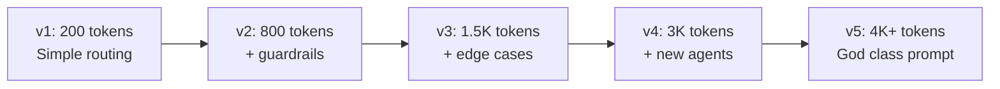
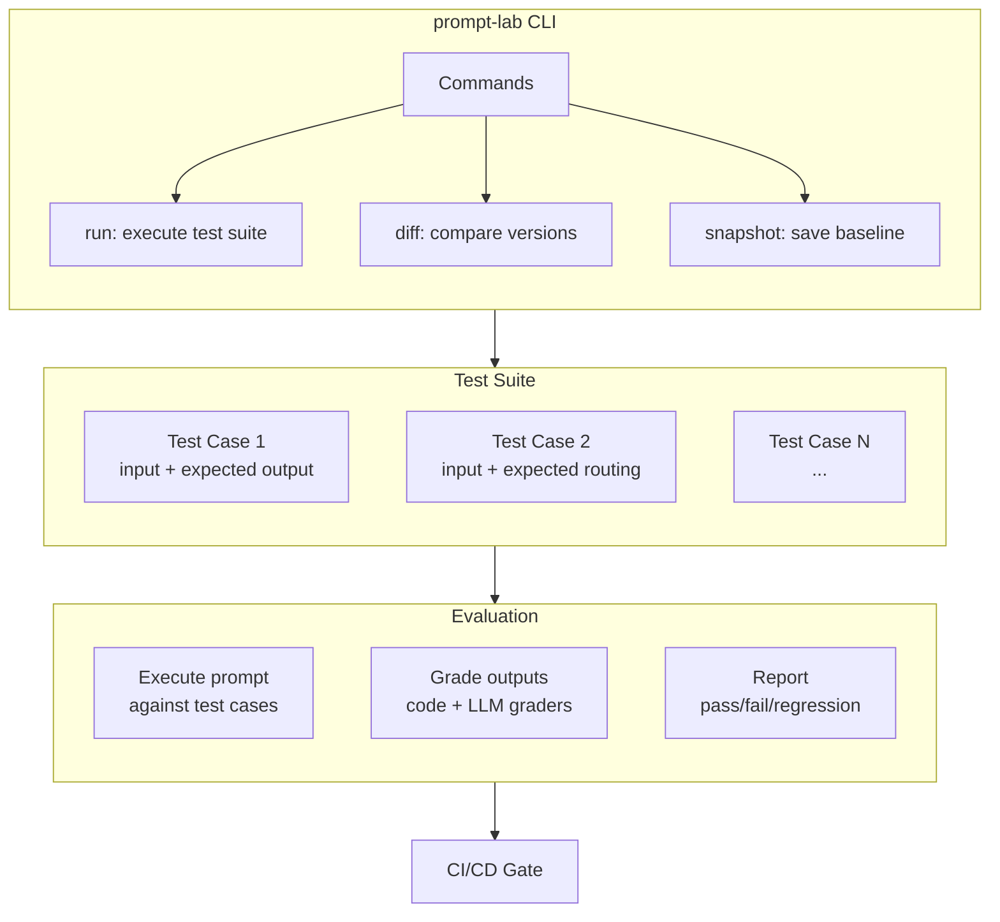
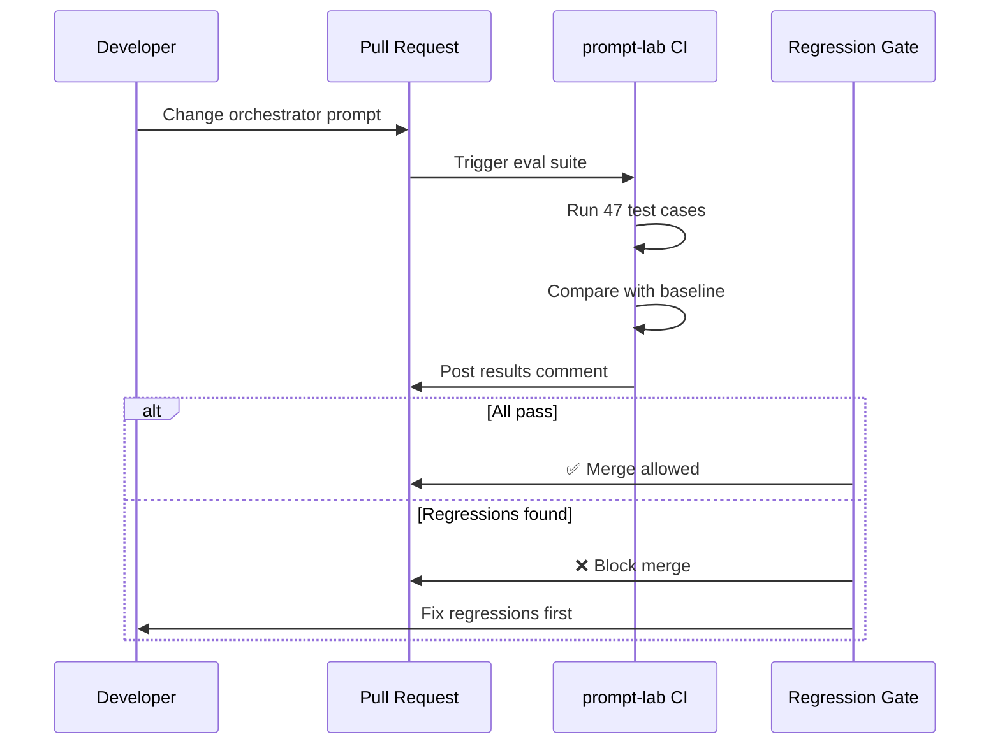
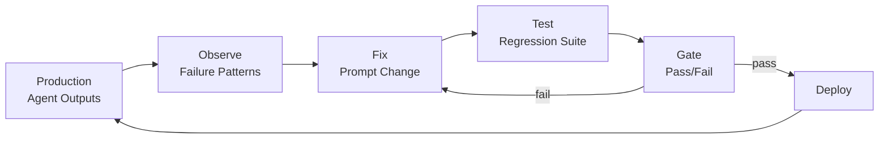

## Your Orchestrator Prompt Is a God Class

At Epiminds, our orchestrator prompt grew from 200 tokens to 4,000 in three months. It had routing logic, guardrails, persona instructions, tool descriptions, output format rules, and edge case patches stacked on top of each other. Every new agent, every new rule, every customer request added another paragraph.

Sound familiar? This is the god class anti-pattern, but for prompts.

I built a prompt-lab CLI with a regression test suite to fix this. Here's why, and how.

## The Problem: Prompt Complexity Grows Faster Than You Think

In a multi-agent system like Epiminds' (20+ agents, supervisor architecture), the orchestrator prompt is the single point that decides which agent handles what, what context to pass, and how to format outputs. It's the air traffic controller.

But unlike code, prompts don't have types, tests, or refactoring tools. When something breaks, you patch the prompt. When a new agent is added, you append instructions. When an edge case appears, you add a conditional paragraph.



[Zalt's analysis](https://zalt.me/blog/2026/03/agent-god-object) of CrewAI's `Agent` class shows the same pattern in code: orchestration, guardrails, memory, knowledge, tools, retries, and platform logic all wired into one class. The recommendation: treat the agent like an air traffic controller, not the entire airport.

The same applies to prompts. Your orchestrator prompt should coordinate. It shouldn't contain every rule.

## Why You Can't Just "Be Careful"

Three things make prompt god classes inevitable without tooling:

1. **No regression visibility.** You change one instruction to fix agent A's routing. Agent B's output format silently breaks. You don't notice until a customer reports it.

2. **No diff review.** Code has pull requests. Prompts get edited in dashboards, Notion docs, or config files with no review process.

3. **No self-learning closure.** The agent produces outputs, you observe problems, you patch the prompt. But there's no systematic way to verify the patch didn't break what was already working.

[Anthropic's agent eval guide](https://www.anthropic.com/engineering/demystifying-evals-for-ai-agents) makes this explicit: capability evals should start at low pass rates (measuring new abilities), while **regression evals must maintain ~100% pass rates** (protecting against backsliding). Without both, you're flying blind.

## The Solution: Prompt-Lab CLI

I built a CLI tool that treats prompts like code: versioned, testable, with a regression suite that runs before any change ships.

### Architecture



### How It Works

**1. Define test cases as YAML fixtures:**

Each test case captures a real scenario: a user message, the expected agent routing, and the expected output characteristics.

```yaml
- name: "route_to_data_analyst"
  input: "Show me CTR trends for the Nike campaign"
  expect:
    routed_to: "data_analyst"
    contains: ["CTR", "trend"]
    not_contains: ["I don't know", "error"]

- name: "route_to_copywriter"  
  input: "Write 3 ad variants for mobile users"
  expect:
    routed_to: "copywriter"
    output_count: 3
    tone: "professional"
```

**2. Run the suite against the current prompt version:**

```bash
$ prompt-lab run --suite routing.yaml --prompt orchestrator-v5.txt

Running 47 test cases...
✓ route_to_data_analyst     (data_analyst, 340ms)
✓ route_to_copywriter       (copywriter, 520ms)  
✗ route_to_strategy         (got: data_analyst, expected: strategy)
✓ handle_ambiguous_request  (clarification, 280ms)

Results: 45/47 passed, 2 regressions detected
```

**3. Diff against the previous snapshot:**

```bash
$ prompt-lab diff --baseline v4 --current v5

Regressions (2):
  - route_to_strategy: was strategy, now data_analyst
  - budget_edge_case: was correct, now hallucinating

Improvements (5):
  - mobile_routing: was wrong, now correct
  - creative_scoring: accuracy 72% → 89%
```

### The Regression Gate

The key insight from [Braintrust's CI/CD integration](https://www.braintrust.dev/articles/best-ai-evals-tools-cicd-2025): when you open a PR that changes a prompt, the eval suite runs automatically and posts results showing exactly which cases improved, which regressed, and by how much.



## Closing the Self-Learning Loop

The deeper problem isn't just testing. It's that agent systems need to learn from production feedback without accumulating unbounded prompt complexity.

[Promptfoo](https://github.com/promptfoo/promptfoo) (now part of OpenAI) solved part of this: declarative test configs with CI integration. [Anthropic's eval guide](https://www.anthropic.com/engineering/demystifying-evals-for-ai-agents) showed that starting with 20-50 simple test cases catches most issues. [Braintrust](https://www.braintrust.dev/articles/ai-agent-evaluation-framework) closes the loop between production traces and eval suites.

But the missing piece for multi-agent orchestrators is **decomposition testing**: validating that your prompt changes don't just produce correct outputs, but route to the right agents with the right context.



This is what harness engineering means in practice: the test harness isn't an afterthought. It's the mechanism that prevents your orchestrator from becoming a god class. Every new rule gets a test case. Every fix gets a regression check. The prompt grows, but the quality stays measurable.

## Rules I Follow Now

1. **Every prompt change needs a test case.** If you can't write a test for it, you don't understand the change well enough.
2. **Snapshot baselines after every deploy.** You need a known-good state to diff against.
3. **Grade outcomes, not paths.** Don't test "did the agent say these exact words?" Test "did it route correctly and produce useful output?"
4. **Separate routing tests from output tests.** Routing is deterministic-ish and should have near-100% pass rates. Output quality is fuzzier and measured with LLM graders.
5. **Run the suite in CI.** Not manually. Not "when we remember." On every PR that touches a prompt.

---

*Part of the agent infrastructure work at [Epiminds](https://epiminds.com/). The prompt-lab CLI draws from approaches by [Promptfoo](https://github.com/promptfoo/promptfoo), [Braintrust](https://www.braintrust.dev/), and patterns described in [Anthropic's eval guide](https://www.anthropic.com/engineering/demystifying-evals-for-ai-agents).*

## References

- [Demystifying Evals for AI Agents](https://www.anthropic.com/engineering/demystifying-evals-for-ai-agents) — Anthropic
- [When One Agent Class Knows Too Much](https://zalt.me/blog/2026/03/agent-god-object) — God object anti-pattern analysis
- [Promptfoo: Test Your Prompts, Agents, and RAGs](https://github.com/promptfoo/promptfoo) — Now part of OpenAI
- [AI Agent Evaluation: A Practical Framework](https://www.braintrust.dev/articles/ai-agent-evaluation-framework) — Braintrust
- [Best AI Evals Tools for CI/CD](https://www.braintrust.dev/articles/best-ai-evals-tools-cicd-2025) — Braintrust
- [Agent Harness Engineering Guide](https://qubittool.com/blog/agent-harness-evaluation-guide) — QubitTool
- [LLM Testing Tools and Frameworks in 2026](https://contextqa.com/blog/llm-testing-tools-frameworks-2026/) — ContextQA
- [Multi-Agent Orchestration Patterns](https://www.startuphub.ai/ai-news/artificial-intelligence/2026/multi-agent-orchestration-patterns) — StartupHub
